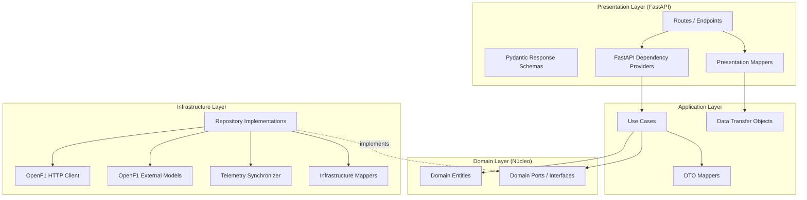
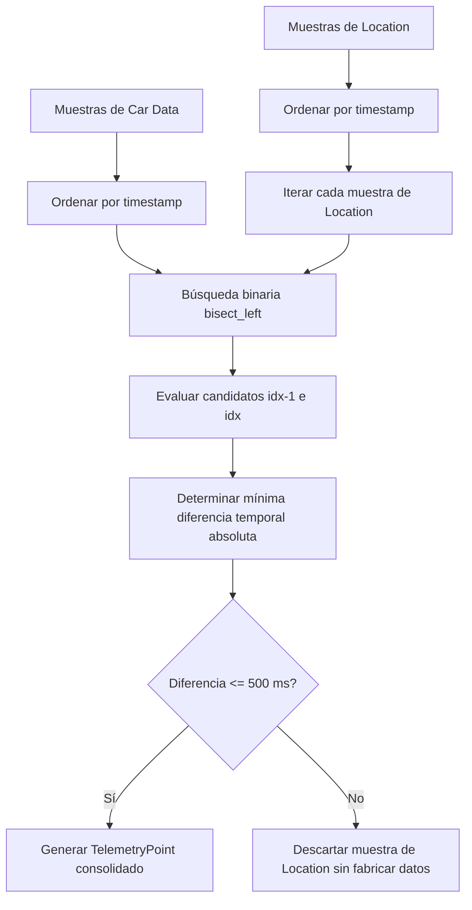
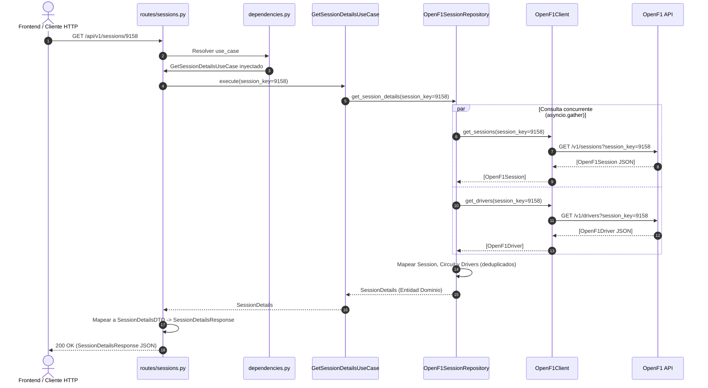
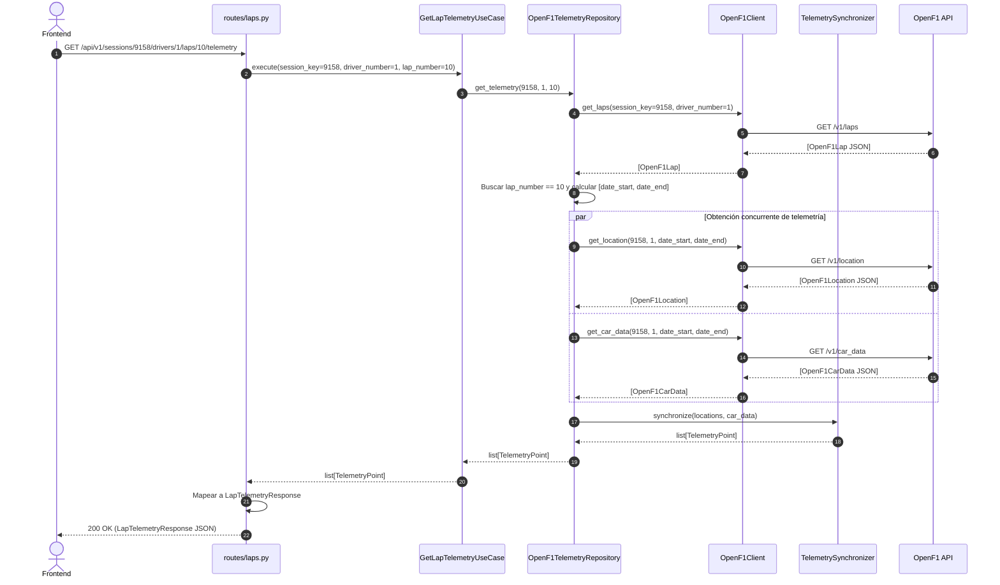

# Architecture Documentation

## 1. Visión General

**F1 Telemetry BFF** está diseñado bajo los principios de **Clean Architecture** (Arquitectura Limpia) y **SOLID**. El propósito fundamental del sistema es desacoplar la lógica de negocio y las necesidades del frontend de los detalles de implementación tecnológica, proveedores externos y frameworks de transporte.

La arquitectura asegura que cambios en:
* el proveedor de datos externo ([OpenF1](https://openf1.org/));
* el framework web (FastAPI);
* la biblioteca HTTP (HTTPX);
* el motor de serialización (Pydantic);
* o los mecanismos de almacenamiento y caché;

puedan realizarse en la periferia del sistema sin afectar las reglas centrales del dominio ni los casos de uso.

---

## 2. Organización en Capas

El sistema se organiza en cuatro capas concéntricas con responsabilidades unívocas:



---

## 3. Regla de Dependencia (The Dependency Rule)

Las dependencias en el código fuente apuntan estrictamente hacia el centro del círculo arquitectónico:

```text
Presentation ───────► Application ───────► Domain
                                              ▲
Infrastructure ───────────────────────────────┘ (implements Ports)
```

1. **El Dominio es completamente agnóstico:** No importa ni depende de FastAPI, HTTPX, Pydantic, frameworks ni APIs externas.
2. **La Aplicación depende exclusivamente del Dominio:** Orquesta los casos de uso interactuando únicamente con entidades y puertos abstractos.
3. **La Infraestructura depende del Dominio:** Implementa los puertos definidos por el Dominio (Inversión de Dependencias).
4. **La Presentación depende de la Aplicación y del Dominio:** Traduce las peticiones HTTP externas, invoca los casos de uso e inyecta las implementaciones de infraestructura mediante dependencias.

---

## 4. Detalle de las Capas

### 4.1 Domain Layer (`src/f1_telemetry_bff/domain/`)

Es el núcleo inmutable del sistema. Modela los conceptos y reglas de negocio de la Fórmula 1.

#### Entidades (`domain/entities/`)
Definidas mediante `@dataclass(frozen=True, slots=True)` para garantizar inmutabilidad, rendimiento en memoria y pureza:

* [`Session`](src/f1_telemetry_bff/domain/entities/session.py): Representa una sesión de F1 (`session_key`, `session_name`, `session_type`, `year`).
* [`Circuit`](src/f1_telemetry_bff/domain/entities/circuit.py): Representa un trazado de circuito (`circuit_key`, `name`, `country`, `location`).
* [`Driver`](src/f1_telemetry_bff/domain/entities/driver.py): Representa a un piloto (`driver_number`, `name`, `acronym`, `team`, `team_name`, `team_colour`). Mantiene compatibilidad hacia atrás sincronizando `team` y `team_name`.
* [`Lap`](src/f1_telemetry_bff/domain/entities/lap.py): Representa una vuelta cronometrada completada (`lap_number`, `driver_number`, `lap_time`, `date_start`).
* [`TelemetryPoint`](src/f1_telemetry_bff/domain/entities/telemetry_point.py): Punto temporal de telemetría consolidado (`timestamp`, `x`, `y`, `z`, `speed`, `throttle`, `brake`, `gear`).
* [`SessionDetails`](src/f1_telemetry_bff/domain/entities/session_details.py): Agregado que reúne la sesión, su circuito y la lista de pilotos participantes.

#### Puertos (`domain/ports/`)
Interfaces abstractas (`abc.ABC`) que declaran los contratos requeridos por el negocio:

* [`SessionRepository`](src/f1_telemetry_bff/domain/ports/session_repository.py):
  * `get_session_details(session_key: int) -> SessionDetails | None`
* [`TelemetryRepository`](src/f1_telemetry_bff/domain/ports/telemetry_repository.py):
  * `get_laps(session_key: int, driver_number: int) -> list[Lap]`
  * `get_telemetry(session_key: int, driver_number: int, lap_number: int) -> list[TelemetryPoint]`
  * `get_telemetry_for_lap(session_key: int, driver_number: int, lap: Lap) -> list[TelemetryPoint]`
* [`Cache`](src/f1_telemetry_bff/domain/ports/cache.py):
  * `get(key: str) -> Any | None`
  * `set(key: str, value: Any, ttl: int) -> None`
  * `delete(key: str) -> None`

#### Reglas de Negocio Relevantes
* **Vueltas completas obligatorias:** Una vuelta solo es válida si posee tanto duración registrada (`lap_duration`) como fecha/hora de inicio (`date_start`). Las vueltas incompletas o de instalación sin cronometraje son filtradas antes de llegar al dominio.
* **Alineación temporal sin falsificación:** Los datos de telemetría de posición y auto solo se consideran válidos si coinciden dentro de una ventana máxima de 500 ms.

---

### 4.2 Application Layer (`src/f1_telemetry_bff/application/`)

Contiene los casos de uso específicos de la aplicación y los objetos de transferencia de datos (DTOs).

#### Casos de Uso (`application/use_cases/`)
* [`GetSessionDetailsUseCase`](src/f1_telemetry_bff/application/use_cases/get_session_details.py): Coordina la obtención de metadatos de sesión, circuito y pilotos a través de `SessionRepository`.
* [`GetSessionLapsUseCase`](src/f1_telemetry_bff/application/use_cases/get_session_laps.py): Obtiene las vueltas completadas de un piloto para una sesión vía `TelemetryRepository`.
* [`GetLapTelemetryUseCase`](src/f1_telemetry_bff/application/use_cases/get_lap_telemetry.py): Obtiene los puntos de telemetría sincronizados para una vuelta y piloto específicos vía `TelemetryRepository`.

#### Data Transfer Objects (`application/dto/`)
Modelados como dataclasses inmutables para transportar información desacoplada entre capas:
* `SessionDTO`, `CircuitDTO`, `DriverDTO`, `SessionDetailsDTO` ([`dto/session.py`](src/f1_telemetry_bff/application/dto/session.py))
* `LapDTO` ([`dto/lap_to_dto.py`](src/f1_telemetry_bff/application/dto/lap_to_dto.py))
* `TelemetryPointDTO` ([`dto/telemetry.py`](src/f1_telemetry_bff/application/dto/telemetry.py))
* Mappers de dominio a DTO ([`dto/mappers.py`](src/f1_telemetry_bff/application/dto/mappers.py))

---

### 4.3 Infrastructure Layer (`src/f1_telemetry_bff/infrastructure/`)

Implementa la comunicación técnica con sistemas y proveedores externos.

#### Cliente OpenF1 (`infrastructure/openf1/client.py`)
Encapsula las llamadas HTTP a la API pública de OpenF1 utilizando `httpx.AsyncClient`. Implementa métodos de bajo nivel:
* `get_sessions(session_key: int | None)`
* `get_drivers(session_key: int)`
* `get_location(session_key, driver_number, date_start, date_end)`
* `get_car_data(session_key, driver_number, date_start, date_end)`

#### Modelos de Contrato Externo (`infrastructure/openf1/models.py`)
Clases Pydantic `BaseModel` que representan la estructura bruta retornada por OpenF1:
* `OpenF1Session`
* `OpenF1Driver`
* `OpenF1Lap`
* `OpenF1Location`
* `OpenF1CarData`

> **Decisión de Diseño:** Estos modelos residen estrictamente en `Infrastructure` porque representan el contrato de un proveedor de terceros. Si OpenF1 cambia un nombre de atributo o tipo, solo se adapta esta capa y sus mappers, sin impacto en el resto de la aplicación.

#### Repositorios Concretos
* [`OpenF1SessionRepository`](src/f1_telemetry_bff/infrastructure/openf1/session_repository.py): Implementa `SessionRepository`. Consulta concurrentemente `/sessions` y `/drivers` con `asyncio.gather`, extrae la información del circuito directamente del payload de sesión (sin llamadas HTTP redundantes) y deduplica pilotos por `driver_number`.
* [`OpenF1TelemetryRepository`](src/f1_telemetry_bff/infrastructure/openf1/repository.py): Implementa `TelemetryRepository`. Consulta las vueltas, filtra las incompletas con `is_complete(lap)` y delega la sincronización de telemetría a `TelemetrySynchronizer`.

#### Sincronizador de Telemetría (`infrastructure/openf1/synchronizer.py`)
Componente especializado en alinear espacialmente y dinámicamente los flujos de OpenF1 (detallado en la sección 6).

---

### 4.4 Presentation Layer (`src/f1_telemetry_bff/presentation/`)

Expone la interfaz HTTP hacia el frontend mediante FastAPI.

#### Rutas (`presentation/api/routes/`)
* [`sessions.py`](src/f1_telemetry_bff/presentation/api/routes/sessions.py): Define `GET /api/v1/sessions/{session_key}`.
* [`laps.py`](src/f1_telemetry_bff/presentation/api/routes/laps.py): Define:
  * `GET /api/v1/sessions/{session_key}/drivers/{driver_number}/laps`
  * `GET /api/v1/sessions/{session_key}/drivers/{driver_number}/laps/{lap_number}/telemetry`

#### Inyección de Dependencias (`presentation/api/dependencies.py`)
Utiliza `Annotated` + `Depends` para componer las dependencias cumpliendo las mejores prácticas de FastAPI y Ruff (regla `B008`):
* `get_http_client(request: Request) -> httpx.AsyncClient`
* `get_get_session_details_use_case(...) -> GetSessionDetailsUseCase`
* `get_get_session_laps_use_case(...) -> GetSessionLapsUseCase`
* `get_get_lap_telemetry_use_case(...) -> GetLapTelemetryUseCase`

#### Schemas y Mappers de Presentación (`presentation/api/schemas/`)
* Esquemas Pydantic v2 de respuesta que definen el contrato público hacia el frontend.
* Mappers que transforman DTOs de aplicación a esquemas de respuesta ([`schemas/mappers.py`](src/f1_telemetry_bff/presentation/api/schemas/mappers.py)).

---

## 5. Ciclo de Vida del Cliente HTTP (Lifespan)

### Decisión Arquitectónica
Se utiliza un único `httpx.AsyncClient` compartido durante toda la vida útil de la aplicación FastAPI mediante el manejador `lifespan`:

```python
@asynccontextmanager
async def lifespan(app: FastAPI) -> AsyncGenerator[None, None]:
    async with httpx.AsyncClient() as client:
        app.state.http_client = client
        yield
```

### Justificación Técnica
1. **Evitar Sobrecarga por Request:** Instanciar un `AsyncClient` por cada petición entrante implica abrir un socket TCP, realizar el handshake TLS correspondiente y destruir el pool en cada request, sumando una penalización severa de latencia.
2. **Reutilización de Conexiones (Connection Pooling):** OpenF1 requiere múltiples peticiones HTTP por cada solicitud de telemetría (consultas a `/location` y `/car_data`). El pool compartido reutiliza conexiones HTTP keep-alive existentes.
3. **Prevención de Agotamiento de Sockets (Socket Exhaustion):** Ante picos de tráfico concurrente, crear y cerrar clientes por request puede agotar los puertos efímeros del sistema operativo (estado `TIME_WAIT`).
4. **Cierre Controlado:** Al detener la aplicación FastAPI, el bloque `async with` del `lifespan` garantiza el drenado y cierre limpio de todas las conexiones activas.

---

## 6. Sincronización de Telemetría

### Contexto del Problema
OpenF1 expone la información de carrera en endpoints independientes:
* `/location`: Muestras con coordenadas `x`, `y`, `z` y timestamp `date`.
* `/car_data`: Muestras con `speed`, `throttle`, `brake`, `gear` y timestamp `date`.

Ambos flujos emiten eventos a frecuencias aproximadas de 3.5 a 4 Hz (~250-300 ms entre muestras), pero sus relojes de muestreo no están sincronizados en el mismo milisegundo exacto.

### Algoritmo de Sincronización ([`TelemetrySynchronizer`](src/f1_telemetry_bff/infrastructure/openf1/synchronizer.py))



1. **Ordenamiento Temporal:** Se asegura el orden cronológico estricto de ambos flujos por su campo `date`.
2. **Búsqueda Eficiente:** Para cada muestra de ubicación, se aplica búsqueda binaria (`bisect.bisect_left`) sobre las fechas de `car_data` con complejidad $O(\log N)$.
3. **Candidato Óptimo:** Se compara el candidato inmediato anterior (`idx - 1`) y el candidato actual (`idx`) para hallar la muestra de dinámica con la menor distancia temporal absoluta respecto a la ubicación.
4. **Tolerancia Máxima (500 ms):** Si la distancia temporal es menor o igual a `DEFAULT_MAX_TIME_DELTA` (500 milisegundos), se fusionan ambas lecturas en una entidad `TelemetryPoint`.
5. **No Fabricación de Datos:** Si no existe ninguna muestra de dinámica dentro del rango de 500 ms, la muestra de ubicación se descarta por completo. **No se interpolan ni inventan valores artificiales**, garantizando fidelidad física de la telemetría.

---

## 7. Flujo de Datos de una Petición

### 7.1 Consulta de Sesión (`GET /api/v1/sessions/{session_key}`)



---

### 7.2 Consulta de Telemetría de Vuelta (`GET .../laps/{lap_number}/telemetry`)



---

## 8. Estrategia de Testing

El proyecto adopta una estrategia de pruebas exhaustiva sin dependencias externas:

```text
tests/
├── unit/
│   ├── application/
│   │   ├── dto/                    # Mapeo y consistencia de DTOs
│   │   └── use_cases/              # Casos de uso aislados con FakeRepositories
│   ├── config/                     # Carga de Settings y variables de entorno
│   ├── domain/
│   │   ├── entities/               # Inmutabilidad y reglas de entidades
│   │   └── ports/                  # Comprobación de no instanciabilidad de puertos abstractos
│   ├── infrastructure/
│   │   └── openf1/
│   │       ├── test_client.py      # Transporte HTTP aislado con httpx.MockTransport
│   │       ├── test_mappers.py     # Mapeo OpenF1 -> Dominio y filtro is_complete
│   │       ├── test_repository.py  # Filtrado de vueltas y obtención de telemetría
│   │       ├── test_openf1_session_repository.py # Resolución de sesiones y deduplicación
│   │       └── test_synchronizer.py# Algoritmo de sincronización y tolerancia 500 ms
│   └── presentation/
│       ├── test_lifespan.py        # Inicialización y cierre de client HTTP en app.state
│       └── api/
│           ├── test_dependencies.py# Proveedores de inyección de dependencias
│           └── schemas/            # Mappers de DTO -> Response Schemas
└── integration/
    └── presentation/
        └── api/                    # Endpoints completos con TestClient y app.dependency_overrides
            ├── test_laps.py
            ├── test_sessions.py
            └── test_telemetry.py
```

### Criterios de Aislamiento
* **Cero llamadas de red reales:** Todas las peticiones HTTP se interceptan mediante `httpx.MockTransport`.
* **Fakes de Repositorios y Casos de Uso:** En pruebas de integración de FastAPI, se inyectan clases `Fake*` mediante `app.dependency_overrides`, verificando códigos de estado (200, 404, 422), serialización JSON y paso exacto de parámetros.
* **Limpieza de Overrides:** Se utiliza un fixture con `autouse=True` para asegurar que `app.dependency_overrides.clear()` se ejecute después de cada test.

---

## 9. Flujo de Trabajo GitFlow y Calidad de Código

* **Estructura de Ramas:**
  * `main`: Producción.
  * `develop`: Integración activa.
  * `feature/*`: Ramas de corta duración orientadas a incrementos concretos.
* **Integración Continua (CI):**
  * GitHub Actions ejecuta en cada push y PR:
    * `uv run pytest`: 84 pruebas automatizadas con 100% de éxito.
    * `uv run ruff check .`: Cumplimiento estricto de reglas de linter y convenciones de importación.
    * `uv run ruff format --check .`: Verificación de formateo homogéneo del código.
