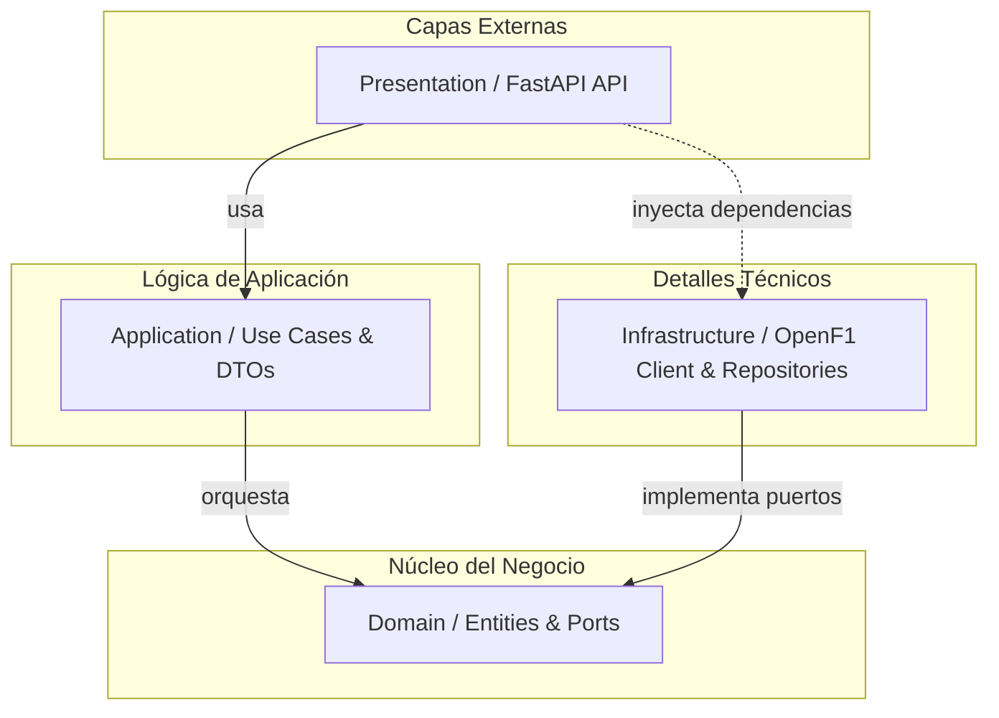

# F1 Telemetry BFF

Backend for Frontend (BFF) desarrollado con **Python 3.12+** y **FastAPI** para la ingesta, normalización, sincronización y consulta de datos de telemetría y vueltas de Fórmula 1 a partir de la API pública de [OpenF1](https://openf1.org/).

El objetivo central del BFF es desacoplar al frontend de la complejidad inherente de OpenF1 (múltiples endpoints independientes, streams desincronizados, formatos heterogéneos y datos incompletos), ofreciendo una API REST optimizada, tipada y lista para la visualización y análisis de rendimiento de pilotos.

---

## Características actuales

* **Información de Sesión y Circuito:** Consulta de metadatos de sesión (año, tipo, nombre), información del circuito asociado y nómina de pilotos participantes con sus equipos y colores distintivos en un único endpoint consolidado.
* **Consulta de Vueltas de Piloto:** Obtención de vueltas completadas por un piloto en una sesión determinada, con filtrado automático de vueltas incompletas o sin registro de tiempo/inicio en origen.
* **Telemetría Real de Vuelta:** Extracción de puntos de telemetría espacial (`x`, `y`, `z`) combinados con datos de dinámica del monoplaza (`speed`, `throttle`, `brake`, `gear`).
* **Sincronización Temporal de Precisión:** Fusión de flujos independientes de ubicación y dinámica mediante búsqueda del timestamp más cercano con ventana de tolerancia máxima de 500 ms, sin invención ni interpolación de datos artificiales.
* **Gestión Eficiente de Conexiones:** Cliente HTTP asíncrono (`httpx.AsyncClient`) único y compartido a través del ciclo de vida (`lifespan`) de FastAPI, maximizando la reutilización de conexiones y evitando agotamiento de sockets.
* **Clean Architecture & SOLID:** Separación estricta de responsabilidades entre Dominio, Aplicación, Infraestructura y Presentación.

---

## Stack Tecnológico

Obtenido y fijado en [`pyproject.toml`](./pyproject.toml):

* **Lenguaje:** Python `>=3.12`
* **Framework Web:** [FastAPI](https://fastapi.tiangolo.com/) `>=0.142.2`
* **Modelado y Validación:** [Pydantic v2](https://docs.pydantic.dev/) `>=2.13.5` y [pydantic-settings](https://docs.pydantic.dev/latest/concepts/pydantic_settings/) `>=2.15.0`
* **Cliente HTTP Asíncrono:** [HTTPX](https://www.python-httpx.org/) `>=0.28.1`
* **Servidor ASGI:** [Uvicorn](https://www.uvicorn.org/) `>=0.54.0` (standard)
* **Gestor de Paquetes y Entorno:** [uv](https://docs.astral.sh/uv/)
* **Testing:** [pytest](https://docs.pytest.org/) `>=9.1.1` y [pytest-asyncio](https://github.com/pytest-dev/pytest-asyncio) `>=1.4.0`
* **Linter y Formateador:** [Ruff](https://docs.astral.sh/ruff/) `>=0.16.10`
* **Fuente de Datos Externa:** [OpenF1 REST API](https://api.openf1.org/v1)

---

## Arquitectura

El proyecto implementa los principios de **Clean Architecture** (Arquitectura Limpia) y diseño guiado por el dominio (DDD conceptual), garantizando que las reglas de negocio sean independientes de librerías externas, frameworks de transporte o detalles de proveedores de datos.



### Regla de Dependencia
Las dependencias apuntan estrictamente hacia el interior. El núcleo (`Domain`) no conoce ni importa `fastapi`, `pydantic`, `httpx` ni ningún modelo de `OpenF1`.

---

## Estructura del Proyecto

```text
.
├── .github/
│   └── workflows/
│       └── ci.yml               # Pipeline de integración continua
├── src/
│   └── f1_telemetry_bff/
│       ├── config/              # Configuración y settings vía variables de entorno
│       │   └── settings.py
│       ├── domain/              # Capa de Dominio (Núcleo)
│       │   ├── entities/        # Entidades: Session, Circuit, Driver, Lap, TelemetryPoint
│       │   ├── ports/           # Puertos/Interfaces: SessionRepository, TelemetryRepository, Cache
│       │   └── value_objects/   # Value objects (reservado)
│       ├── application/         # Capa de Aplicación
│       │   ├── dto/             # Data Transfer Objects y mappers internos
│       │   └── use_cases/       # Casos de uso (GetSessionDetails, GetSessionLaps, GetLapTelemetry)
│       ├── infrastructure/      # Capa de Infraestructura
│       │   ├── cache/           # Adaptadores de caché
│       │   ├── openf1/          # Cliente OpenF1, modelos externos, mappers y sincronizador
│       │   └── repositories/    # Adaptadores de repositorios
│       ├── presentation/        # Capa de Presentación
│       │   └── api/             # FastAPI: dependencias, rutas y esquemas de respuesta
│       └── main.py              # Fábrica de aplicación FastAPI y lifespan
├── tests/
│   ├── unit/                    # Tests unitarios aislados por capa
│   └── integration/             # Tests de integración de endpoints (con TestClient y Fakes)
├── pyproject.toml               # Configuración del proyecto, dependencias, ruff y pytest
├── uv.lock                      # Lockfile reproducible de dependencias
└── README.md
```

---

## Instalación y Requisitos

### Requisitos Previos

* **Python 3.12+**
* **uv** (herramienta recomendada para gestión de entornos y dependencias)
* **Git**

### Pasos de Instalación

1. Clonar el repositorio:
   ```bash
   git clone <URL_DEL_REPOSITORIO>
   cd f1-telemetry-bff
   ```

2. Instalar dependencias y sincronizar el entorno virtual con `uv`:
   ```bash
   uv sync
   ```

3. Configurar variables de entorno:
   Copiar el archivo de ejemplo (si existe) o crear `.env` en la raíz:
   ```bash
   cp .env.example .env
   ```
   *Configuración por defecto:*
   ```ini
   OPENF1_BASE_URL=https://api.openf1.org/v1
   ENVIRONMENT=development
   ```

---

## Ejecución

Para iniciar el servidor de desarrollo local con recarga en caliente:

```bash
uv run uvicorn f1_telemetry_bff.main:app --reload
```

El servicio estará disponible en:
* **API Base:** `http://127.0.0.1:8000`
* **Documentación interactiva (Swagger / OpenAPI):** `http://127.0.0.1:8000/docs`
* **Documentación alternativa (ReDoc):** `http://127.0.0.1:8000/redoc`

---

## Testing

El conjunto de pruebas utiliza `pytest` y `pytest-asyncio`. Ningún test realiza peticiones de red reales; las dependencias externas se aíslan mediante mocks de transporte (`httpx.MockTransport`) o fakes en memoria.

Ejecutar la suite completa de pruebas:

```powershell
uv run pytest
```

Ejecutar únicamente pruebas unitarias:

```powershell
uv run pytest tests/unit
```

Ejecutar únicamente pruebas de integración:

```powershell
uv run pytest tests/integration
```

---

## Linting y Formateo de Código

El proyecto utiliza **Ruff** para validación estática, ordenamiento de imports (`isort`) y formateo de código conforme a las reglas definidas en `pyproject.toml`.

Verificar cumplimiento de reglas de linting:

```powershell
uv run ruff check .
```

Verificar formateo de código sin modificar archivos:

```powershell
uv run ruff format --check .
```

Formatear código automáticamente:

```powershell
uv run ruff format .
```

---

## Endpoints de la API

### 1. Health Check

* **Método:** `GET`
* **Ruta:** `/health`
* **Propósito:** Comprobación de estado y disponibilidad del servicio.
* **Respuesta Exitosa (200 OK):**
  ```json
  {
    "status": "ok"
  }
  ```

---

### 2. Detalle de Sesión, Circuito y Pilotos

* **Método:** `GET`
* **Ruta:** `/api/v1/sessions/{session_key}`
* **Propósito:** Obtener la información de una sesión de F1, el circuito en el que se disputó y la lista de pilotos participantes.
* **Parámetros de Ruta:**
  * `session_key` *(int)*: Identificador único de la sesión en OpenF1 (ej: `9158`).
* **Respuesta Exitosa (200 OK):**
  ```json
  {
    "session": {
      "session_key": 9158,
      "session_name": "Practice 1",
      "session_type": "Practice",
      "year": 2023
    },
    "circuit": {
      "circuit_key": 61,
      "name": "Marina Bay",
      "country": "Singapore",
      "location": "Marina Bay"
    },
    "drivers": [
      {
        "driver_number": 1,
        "name": "Max Verstappen",
        "acronym": "VER",
        "team_name": "Red Bull Racing",
        "team_colour": "3671C6"
      },
      {
        "driver_number": 44,
        "name": "Lewis Hamilton",
        "acronym": "HAM",
        "team_name": "Mercedes",
        "team_colour": "00D2BE"
      }
    ]
  }
  ```
* **Errores Posibles:**
  * `404 Not Found`: Si la sesión no existe en OpenF1.
  * `422 Unprocessable Entity`: Si `session_key` no es un entero válido.

---

### 3. Vueltas de un Piloto en una Sesión

* **Método:** `GET`
* **Ruta:** `/api/v1/sessions/{session_key}/drivers/{driver_number}/laps`
* **Propósito:** Devolver la lista de vueltas válidas y completadas por un piloto en una sesión. Las vueltas sin duración o sin fecha de inicio son descartadas automáticamente.
* **Parámetros de Ruta:**
  * `session_key` *(int)*: Identificador de la sesión.
  * `driver_number` *(int)*: Número de carrera del piloto (ej: `1`).
* **Respuesta Exitosa (200 OK):**
  ```json
  [
    {
      "lap_number": 1,
      "driver_number": 1,
      "lap_time": 82.456,
      "date_start": "2023-09-15T09:35:10Z"
    },
    {
      "lap_number": 2,
      "driver_number": 1,
      "lap_time": 81.123,
      "date_start": "2023-09-15T09:36:32.456Z"
    }
  ]
  ```
* **Errores Posibles:**
  * `422 Unprocessable Entity`: Parámetros de ruta con formato inválido.

---

### 4. Telemetría Sincronizada de una Vuelta

* **Método:** `GET`
* **Ruta:** `/api/v1/sessions/{session_key}/drivers/{driver_number}/laps/{lap_number}/telemetry`
* **Propósito:** Obtener la serie temporal sincronizada de puntos de telemetría de una vuelta específica de un piloto.
* **Parámetros de Ruta:**
  * `session_key` *(int)*: Identificador de la sesión.
  * `driver_number` *(int)*: Número del piloto.
  * `lap_number` *(int)*: Número de vuelta solicitada.
* **Respuesta Exitosa (200 OK):**
  ```json
  {
    "session_key": 9158,
    "driver_number": 1,
    "lap_number": 2,
    "telemetry_points": [
      {
        "timestamp": "2023-09-15T09:36:32.456Z",
        "x": 105.4,
        "y": -420.8,
        "z": 12.1,
        "speed": 312.5,
        "throttle": 100.0,
        "brake": 0.0,
        "gear": 8
      },
      {
        "timestamp": "2023-09-15T09:36:32.706Z",
        "x": 120.1,
        "y": -415.2,
        "z": 12.0,
        "speed": 315.0,
        "throttle": 98.0,
        "brake": 0.0,
        "gear": 8
      }
    ]
  }
  ```
* **Errores Posibles:**
  * `422 Unprocessable Entity`: Parámetros de ruta no numéricos.

---

## Integración con OpenF1

El BFF utiliza los siguientes recursos de OpenF1 (`https://api.openf1.org/v1`):
* `/sessions`: Datos maestros de eventos, tipo de sesión y circuito.
* `/drivers`: Nómina de competidores, acrónimos, escuderías y colores.
* `/laps`: Registro de vueltas con marcas temporales y duraciones.
* `/location`: Coordenadas espaciales tridimensionales de los monoplazas muestreadas a ~3.5 Hz.
* `/car_data`: Registro de velocidad, acelerador, frenado y marcha a ~3.5 Hz.

Toda la comunicación externa está aislada en la capa de `Infrastructure` a través de [`OpenF1Client`](src/f1_telemetry_bff/infrastructure/openf1/client.py). Los modelos de validación Pydantic para OpenF1 residen en `infrastructure/openf1/models.py`, asegurando que cambios en la API externa no afecten al dominio de la aplicación.

---

## Integración Continua (CI)

El proyecto cuenta con un workflow automatizado en GitHub Actions ([`.github/workflows/ci.yml`](.github/workflows/ci.yml)) que se ejecuta en:
* Cada evento `push` a cualquier rama.
* Cada `pull_request` con destino a `develop` o `main`.

El pipeline ejecuta en un entorno Ubuntu con Python 3.12:
1. Instalación y configuración de `uv` con caché habilitada.
2. Instalación determinista de dependencias mediante `uv sync --locked`.
3. Ejecución de la suite completa de pruebas: `uv run pytest`.
4. Análisis estático con linter: `uv run ruff check .`.
5. Comprobación de formato: `uv run ruff format --check .`.

Cualquier falla en las etapas anteriores bloquea la integración.

---

## Flujo de Trabajo (GitFlow)

El desarrollo sigue el estándar GitFlow:
* **`main`**: Rama productiva y estable.
* **`develop`**: Rama de integración continua de features.
* **`feature/*`**: Ramas de corta duración para funcionalidades específicas, que nacen de `develop` y se integran mediante Pull Request con revisión y validaciones de CI aprobadas.
